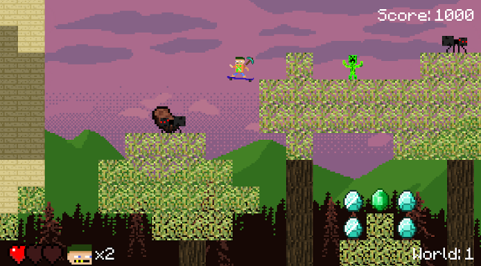

## Welcome to CraftMiner!

<a href="https://github.com/Hety06/CraftMiner/archive/master.zip" class="btn btn-github">Download Zip</a>

In order to play this game you need python v(3.4.4) and the corresponding Pygame version. After having downloaded these files and the Zip file, you will need to double click on the python file named 'game'.

### Rules

<ul>
  <li>Use the arrow keys to move and space to jump</li>
  <li>Watch out for the enemies like</li>
  <li>You cannot kill the enemies</li>
  <ul>
    <li>Creepers</li>
    <li>Spiders</li>
    <li>Zombies</li>
    <li>SilverFish</li>
  </ul>
  <li>Falling off the map does not harm you</li>
  <li>The flag is the end of a level</li>
  <li>The Golden Apple is invincibility</li>
  <li>Rotten Flesh lowers your max hearts</li>  
</ul>  

### Screenshots

